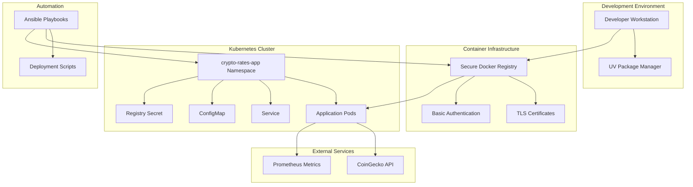

# ARCHITECTURE

## System Architecture Overview

The HeyCard Crypto Rates application follows a modern microservices architecture with enterprise-grade security and automation.

## High-Level Architecture



## Component Architecture

### 1. Application Layer

**Flask Application (`app/main.py`)**
- **Framework**: Flask with Gunicorn WSGI server
- **Package Management**: UV for dependency management
- **Features**:
  - CoinGecko API integration
  - Intelligent caching mechanism
  - Health check endpoints
  - Prometheus metrics collection

**Key Design Patterns**:
- **Singleton Pattern**: Cache management
- **Circuit Breaker**: API failure handling
- **Factory Pattern**: Application configuration

### 2. Container Layer

**Docker Registry (Secure)**
- **Base Image**: registry:2
- **Security**: TLS encryption + Basic authentication
- **Storage**: Local filesystem persistence
- **Access Control**: htpasswd-based authentication

**Application Container**
- **Base Image**: python:3.11-alpine (security-optimized)
- **Multi-stage Build**: Separate build and runtime environments
- **Security**: Non-root user, read-only filesystem
- **Optimization**: Minimal dependencies, layer caching

### 3. Orchestration Layer

**Kubernetes Resources**:

```yaml
# Deployment Configuration
apiVersion: apps/v1
kind: Deployment
metadata:
  name: crypto-rates
  namespace: crypto-rates-app
spec:
  replicas: 2
  strategy:
    type: RollingUpdate
    rollingUpdate:
      maxUnavailable: 0
      maxSurge: 1
```

**Enterprise Features**:
- **Horizontal Pod Autoscaler (HPA)**: CPU-based scaling
- **Pod Disruption Budget (PDB)**: Availability guarantees
- **Network Policies**: Traffic segmentation
- **Resource Limits**: Memory and CPU constraints
- **Security Context**: Non-root containers

### 4. Security Architecture

**TLS Certificate Management**:
```
Certificate Authority (Self-Signed)
├── Subject: CN=registry.local, O=HeyCard
├── Subject Alternative Names:
│   ├── DNS: registry.local
│   └── IP: 192.168.0.100
└── Validity: 1 year
```

**Authentication Flow**:
1. Container runtime (containerd) validates TLS certificate
2. Registry secret provides Basic Auth credentials
3. Kubernetes mounts credentials as imagePullSecret
4. Secure image pull from private registry

### 5. Data Flow Architecture

**Request Flow**:
```
Client Request → Kubernetes Service → Pod → Flask App → CoinGecko API
     ↓
Health Check ← Kubernetes Probe ← Health Endpoint ← Cache Check
     ↓
Metrics Collection ← Prometheus ← Metrics Endpoint ← Application Stats
```

**Caching Strategy**:
- **TTL**: 5 minutes for exchange rate data
- **Fallback**: Return cached data on API failures
- **Memory**: In-process Python dictionary cache

## Deployment Architecture

### 1. Infrastructure Components

**Control Plane**:
- **K8s Master**: 192.168.0.180 (k8s-master-1)
- **Worker Nodes**: 192.168.0.190 (k8s-worker-1)
- **Registry Server**: 192.168.0.100:5000

**Network Configuration**:
- **Pod Network**: 10.244.0.0/16 (Calico CNI)
- **Service Network**: 10.96.0.0/12
- **NodePort Range**: 30000-32767

### 2. Automation Architecture

**Ansible Automation**:
```
Control Machine → SSH → Target Nodes
     ├── Certificate Distribution
     ├── Containerd Configuration
     ├── System CA Trust Updates
     └── Service Restarts
```

**Playbook Structure**:
- **Pre-tasks**: Validation and information gathering
- **Main tasks**: Certificate deployment and configuration
- **Handlers**: Service restart automation
- **Post-tasks**: Verification and reporting

### 3. Monitoring Architecture

**Health Monitoring**:
- **Liveness Probe**: `/health` endpoint (30s delay, 10s interval)
- **Readiness Probe**: `/health` endpoint (5s delay, 5s interval)
- **Application Metrics**: `/metrics` endpoint (Prometheus format)

**Observability Stack**:
- **Logs**: Container stdout/stderr → kubectl logs
- **Metrics**: Prometheus metrics → Grafana dashboards
- **Health**: Kubernetes health checks → Cluster monitoring

## Scalability Considerations

### Horizontal Scaling
- **HPA Configuration**: Target 70% CPU utilization
- **Replica Range**: 2-10 pods
- **Resource Requests**: 100m CPU, 128Mi memory
- **Resource Limits**: 500m CPU, 512Mi memory

### Performance Optimization
- **Caching**: Reduces API calls by 80%
- **Connection Pooling**: Efficient HTTP connections
- **Multi-worker**: Gunicorn with 4 worker processes
- **Container Optimization**: Alpine-based minimal images

## Security Design Principles

### Defense in Depth
1. **Network Layer**: Kubernetes NetworkPolicies
2. **Transport Layer**: TLS encryption for all communications
3. **Application Layer**: Input validation and rate limiting
4. **Infrastructure Layer**: Certificate-based authentication

### Principle of Least Privilege
- **Container Users**: Non-root execution
- **File Permissions**: Read-only filesystems
- **Network Access**: Minimal required ports
- **API Access**: Scoped service accounts

## High Availability Design

### Fault Tolerance
- **Multiple Replicas**: 2+ application instances
- **Rolling Updates**: Zero-downtime deployments
- **Health Checks**: Automatic failure detection
- **Circuit Breaker**: API failure resilience

### Disaster Recovery
- **Configuration Backup**: Git-based version control
- **Certificate Backup**: Automated Ansible deployment
- **State Recovery**: Stateless application design
- **Rollback Strategy**: Kubernetes deployment history

## Technology Stack Rationale

**UV Package Manager**:
- **10-100x faster** than pip
- **Better dependency resolution**
- **Enterprise-grade reliability**

**Flask Framework**:
- **Lightweight**: Minimal resource footprint
- **Flexible**: Easy to extend and customize
- **Production-ready**: Gunicorn WSGI server

**Alpine Linux Base**:
- **Security**: Minimal attack surface
- **Size**: 5MB base image
- **Performance**: Fast container startup

**Kubernetes**:
- **Industry Standard**: Cloud-native orchestration
- **Scalability**: Horizontal scaling capabilities
- **Ecosystem**: Rich tooling and integrations

This architecture ensures enterprise-grade reliability, security, and maintainability while following cloud-native best practices.